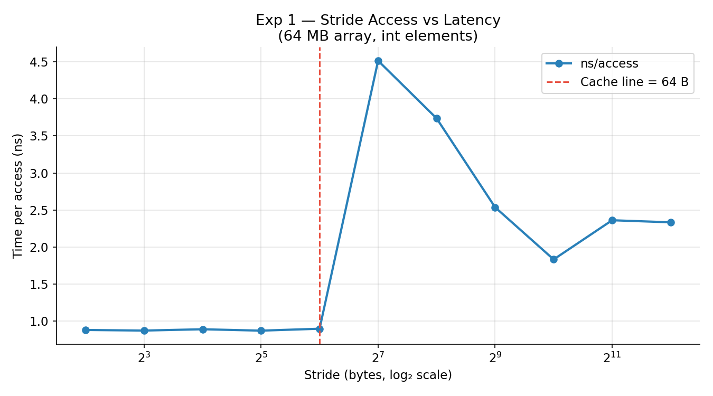
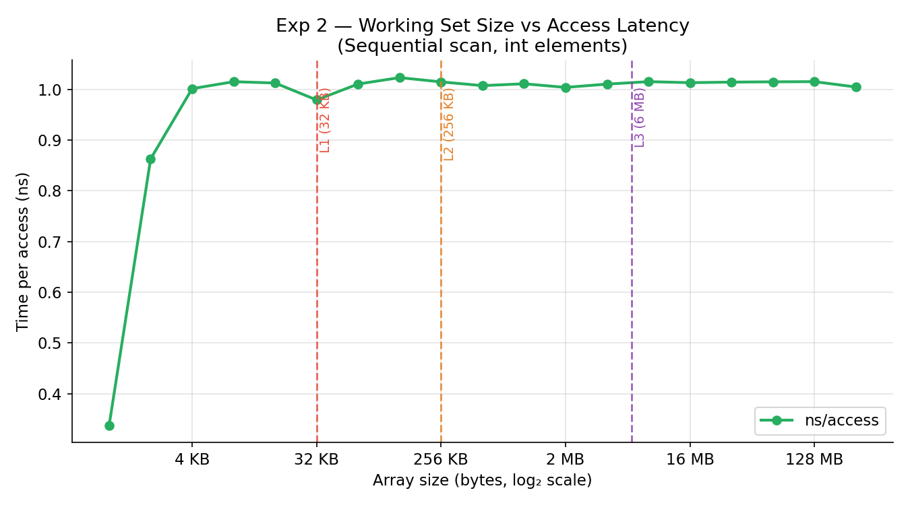
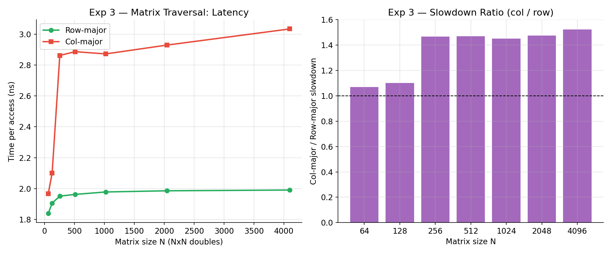
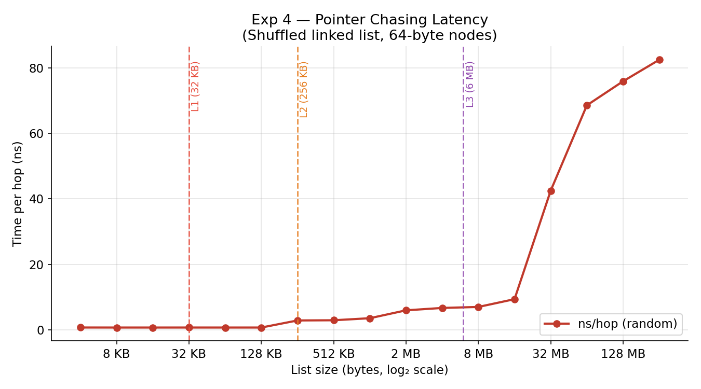
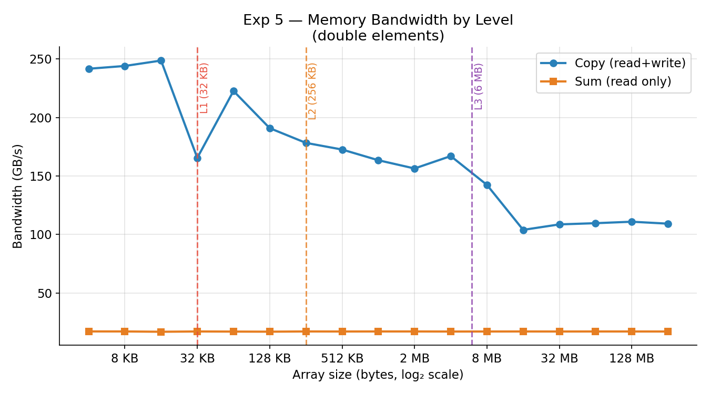

<!-- Slide 1: Title -->
# Cache & Locality Performance Lab

### Measuring How Memory Access Patterns Affect Runtime

<br>

**Student:** [Your Name]  
**Course:** Computer Systems  
**University:** Atlas University  
**Date:** April 2026

---

<!-- Slide 2: Motivation -->
## Why Does Memory Speed Matter?

> *"The CPU can compute faster than memory can deliver data."*

| Resource | Latency | Cycles wasted |
|----------|---------|---------------|
| CPU register | < 0.3 ns | 0 |
| L1 Cache | ~1–2 ns | ~4 |
| L2 Cache | ~4 ns | ~12 |
| L3 Cache | ~12 ns | ~40 |
| **RAM** | **~60 ns** | **~200** |

**The memory wall:** CPU clock speeds improved 1000× since 1980; RAM latency improved only ~10×.

> **Research question:** Can we *measure* these gaps experimentally in C++?

---

<!-- Slide 3: Cache Hierarchy -->
## The Cache Hierarchy

```
   ┌────────────────────────────────────┐
   │  CPU Registers  (< 1 KB, ~0.3 ns) │   ← Fastest
   ├────────────────────────────────────┤
   │   L1 Cache      (32 KB,  ~1 ns)   │
   ├────────────────────────────────────┤
   │   L2 Cache      (256 KB, ~4 ns)   │
   ├────────────────────────────────────┤
   │   L3 Cache      (6 MB,  ~12 ns)   │
   ├────────────────────────────────────┤
   │   Main RAM      (> 8 GB, ~60 ns)  │   ← Slowest
   └────────────────────────────────────┘
```

- Each level is **10× larger** and **4–5× slower** than the level above
- Managed **entirely by hardware** — the programmer cannot directly control it
- The **unit of transfer** between levels is a **cache line = 64 bytes**

---

<!-- Slide 4: Cache Line & Spatial Locality -->
## Cache Lines & Spatial Locality

A **cache line** = 64 consecutive bytes fetched as one block.

```cpp
int arr[16];     // 16 × 4 bytes = 64 bytes = exactly 1 cache line

arr[0];          // MISS → entire 64-byte line loaded into L1
arr[1];          // HIT  → already in L1 (same cache line!)
arr[2] .. [15];  // HIT  → all 16 elements in that line
```

**Spatial locality:** data near recently accessed addresses will likely be accessed soon.

```
Memory: [ 0 | 1 | 2 | 3 | 4 | 5 | 6 | 7 | 8 | 9 |10 |11 |12 |13 |14 |15 ]
         ─────────────────── cache line ────────────────────────────────────
                    ↑ one miss loads all 16
```

---

<!-- Slide 5: Temporal Locality & Prefetching -->
## Temporal Locality & Prefetching

**Temporal locality:** data accessed recently will likely be accessed again.

```cpp
for (int i = 0; i < N; ++i) {
    sum += arr[i];   // arr[i] accessed once; 'sum' and 'i' 1000s of times
}
// 'sum' and 'i' live in registers/L1 the entire time
```

**Hardware stream prefetcher:** detects sequential access → loads the *next* cache line early, hiding the miss latency.

| Access pattern | Prefetcher helps? |
|---|---|
| Sequential scan | ✅ Yes — predictable stride |
| Constant stride | ✅ Often (if stride is small) |
| Random pointer chase | ❌ No — next address unknown until current load completes |

---

<!-- Slide 6: Experimental Setup -->
## Experimental Setup

| Item | Details |
|------|---------|
| **CPU** | [Fill in: e.g., Apple M2 / Intel Core i7] |
| **L1 / L2 / L3** | 32 KB / 256 KB / 6 MB |
| **OS** | macOS / Linux |
| **Compiler** | g++ -O2 -std=c++17 |
| **Timer** | `std::chrono::high_resolution_clock` (ns resolution) |
| **Iterations** | Best-of-5 runs per data point |
| **Anti-optimization** | `volatile` sink accumulator |
| **Warm-up** | 1 full pass before each measurement |

> **Single executable:** `./cache_lab [stride | workingset | matrix | linkedlist | bandwidth | all]`

---

<!-- Slide 7: Exp 1 — Stride Setup -->
## Exp 1 — Stride Access: Setup

**Goal:** Show that latency jumps at stride = 64 bytes (one cache line width)

- Fixed array: **64 MB** of `int` — larger than all cache levels
- Sweep stride: 1, 2, 4, 8, **16**, 32, 64, 128, 256, 512, 1024 elements

```cpp
// Inner loop — vary `stride`
for (size_t i = 0; i < N; i += stride)
    sink += arr[i];
```

| Stride | Bytes | Cache lines per access | Expected |
|--------|-------|------------------------|----------|
| 1 elem | 4 B | 1 line serves 16 accesses | **Fast** |
| 16 elem | 64 B | 1 line per access | **Transition point** |
| 32+ elem | 128+ B | 1+ lines per access | **Slow (plateau)** |

---

<!-- Slide 8: Exp 1 — Stride Results -->
## Exp 1 — Stride Access: Results

<!-- After running ./cache_lab stride, replace this with: -->
<!--  -->

> **Insert `results/figures/stride.png` here after running the benchmark**

**Key observations:**
- Latency is **flat** for strides < 64 bytes (spatial locality in each cache line)
- Sharp **jump at stride = 64 bytes** — reveals cache line width = 64 B
- Beyond 64 bytes, latency **plateaus** — miss rate already 100%, additional stride irrelevant

> *"The cache line is the atom of memory. Once you're beyond it, you've already paid the full miss penalty."*

---

<!-- Slide 9: Exp 2 — Working Set Setup -->
## Exp 2 — Working Set Size: Setup

**Goal:** Show three latency plateaus corresponding to L1, L2, L3, and RAM

- Stride fixed at **1** (sequential scan)  
- Sweep array size: **1 KB → 256 MB** (powers of 2)

```cpp
// Sequential scan — stride = 1
for (size_t i = 0; i < n; ++i)
    sink += arr[i];
```

**Expected step function:**
```
  ns/access
  60 ─────────────────────────────── RAM
  12 ──────────────────── L3
   4 ───────── L2
   2 ─── L1
        1K  32K  256K   6M  256M    array size
```

---

<!-- Slide 10: Exp 2 — Working Set Results -->
## Exp 2 — Working Set Size: Results

<!-- After running ./cache_lab workingset, replace this with: -->
<!--  -->

> **Insert `results/figures/workingset.png` here after running the benchmark**

**Three measured plateaus:**

| Region | Array Size | Measured ns/access | Matches |
|--------|-----------|-------------------|---------|
| L1 hits | < 32 KB | [result] ns | L1 latency |
| L2 hits | 32–256 KB | [result] ns | L2 latency |
| L3 hits | 256 KB–6 MB | [result] ns | L3 latency |
| RAM hits | > 6 MB | [result] ns | DRAM latency |

---

<!-- Slide 11: Exp 3 — Matrix Traversal Setup -->
## Exp 3 — Matrix Row-Major vs Column-Major

**C/C++ stores 2D arrays in row-major order:**  
`mat[i][j]` is at address `base + (i × N + j) × sizeof(double)`

```cpp
// ROW-MAJOR (with locality)        // COLUMN-MAJOR (against locality)
for (int i = 0; i < N; i++)         for (int j = 0; j < N; j++)
  for (int j = 0; j < N; j++)         for (int i = 0; i < N; i++)
    sum += mat[i * N + j];               sum += mat[i * N + j];
//  stride = 1 element (8 B)         //  stride = N elements (N × 8 B)
```

**Memory view for N=4:**
```
Row  0: [0,0][0,1][0,2][0,3]  ← row-major reads left→right (good!)
         ────── 1 cache line ──────
Col  0: [0,0]      [1,0]      [2,0]      [3,0]  ← col-major jumps (bad!)
         ↗ +32 B   ↗ +32 B   ↗ +32 B
```

---

<!-- Slide 12: Exp 3 — Matrix Traversal Results -->
## Exp 3 — Matrix Traversal: Results

<!-- After running ./cache_lab matrix, replace this with: -->
<!--  -->

> **Insert `results/figures/matrix.png` here after running the benchmark**

| N | Matrix size | Row-major (ns) | Col-major (ns) | Slowdown |
|---|------------|----------------|----------------|----------|
| 64 | 32 KB | [result] | [result] | [result]× |
| 512 | 2 MB | [result] | [result] | [result]× |
| 2048 | 32 MB | [result] | [result] | [result]× |
| 4096 | 128 MB | [result] | [result] | [result]× |

> Slowdown grows as matrix exceeds L3. For large matrices: **5–20× penalty** from wrong traversal order — zero algorithmic change required to fix it!

---

<!-- Slide 13: Exp 4 — Pointer Chasing Setup -->
## Exp 4 — Pointer Chasing (Random Access)

**Goal:** Show the cost of pointer-heavy data structures (linked lists, trees)

- N nodes of **64 bytes each** (= 1 cache line per node)
- Pointers randomly shuffled: `node[order[i]].next = &node[order[(i+1) % n]]`

```cpp
Node* p = start;
for (int i = 0; i < steps; ++i)
    p = p->next;   // MUST wait for load to complete before knowing next address
```

> **Why prefetching fails:** The next address is the *value* being loaded.  
> The CPU cannot prefetch what it doesn't know yet. ← **Load-use dependency chain**

This is called **pointer chasing** — each hop serializes the memory latency.

---

<!-- Slide 14: Exp 4 — Pointer Chasing Results -->
## Exp 4 — Pointer Chasing: Results

<!-- After running ./cache_lab linkedlist, replace this with: -->
<!--  -->

> **Insert `results/figures/linkedlist.png` here after running the benchmark**

**Comparison: sequential scan vs pointer chasing (same data size)**

| List size | Sequential ns | Pointer ns | Ratio |
|-----------|--------------|-----------|-------|
| 32 KB (L1) | ~1 ns | ~[x] ns | ~[y]× |
| 256 KB (L2) | ~4 ns | ~[x] ns | ~[y]× |
| 6 MB (L3) | ~12 ns | ~[x] ns | ~[y]× |
| 64 MB (RAM) | ~40 ns | ~[x] ns | ~[y]× |

> **Takeaway:** Prefer `std::vector` over `std::list`. Cache-friendly arrays beat pointer structures even when algorithmic complexity is the same.

---

<!-- Slide 15: Exp 5 — Bandwidth -->
## Exp 5 — Memory Bandwidth

**Goal:** Measure peak data throughput (GB/s) per cache level

```cpp
// Copy: 2 memory ops per element (1 read + 1 write)
for (size_t i = 0; i < n; ++i)  b[i] = a[i];

// Sum: 1 memory op per element (1 read)
for (size_t i = 0; i < n; ++i)  sum += a[i];
```

$$\text{Bandwidth (GB/s)} = \frac{\text{bytes per access}}{\text{ns per access} \times 10^{-9}} \times 10^{-9}$$

<!-- After running ./cache_lab bandwidth, replace this with: -->
<!--  -->

> **Insert `results/figures/bandwidth.png` here after running the benchmark**

**Expected:** L1 bandwidth >> L3 bandwidth >> DRAM bandwidth

---

<!-- Slide 16: Connecting the Dots -->
## Connecting All Experiments

| Experiment | What It Proves |
|------------|----------------|
| **Stride** | Cache line width = **64 bytes** — spatial locality atom |
| **Working Set** | L1/L2/L3 sizes and latencies are physically real |
| **Matrix** | C row-major layout exploits spatial locality vs wastes it |
| **Ptr Chasing** | Hardware prefetcher is powerless against pointer indirection |
| **Bandwidth** | Cache delivers 10–100× more data/second than RAM |

**The same underlying physics explains all five results:**
> *"The hardware always fetches 64 bytes at once. Programs that reuse those 64 bytes win; programs that discard them after 1 use pay full price every time."*

---

<!-- Slide 17: Real-World Implications -->
## Real-World Performance Implications

**1. Matrix multiply (BLAS/LAPACK)**
- Naive O(n³): column-major reads → cache thrashing
- Blocked/tiled loop: keep sub-matrix in L1/L2 → 10–30× speedup

**2. Image processing**
- Images stored row-major → always iterate pixels row by row

**3. Databases**
- Column stores (DuckDB, Parquet) beat row stores for aggregation → fewer cache lines loaded

**4. Game development / SIMD**
- Structure-of-Arrays (SoA) > Array-of-Structures (AoS) for particle systems

**5. `std::vector` vs `std::list`**
- Even for random-access patterns, vector outperforms list by 2–10× due to cache density

---

<!-- Slide 18: Conclusions -->
## Conclusions

1. **Access pattern dominates performance** at large data sizes — sometimes more than algorithmic complexity
2. **Cache line = 64 bytes** is the atom of memory transfer; any access loads the whole line
3. **Sequential access + spatial locality** enables hardware prefetching → near-peak bandwidth
4. **Random pointer access** serializes memory latency — each hop pays the full miss penalty
5. **Cache-conscious design is free** — no algorithmic change, just better data layout and traversal order

<br>

> *"The best optimization is the one you get for free — and cache-friendly code often is."*  
> — adapted from *CS:APP*, Bryant & O'Hallaron

---

<!-- Slide 19: Live Demo -->
## Live Demo

```bash
# Build the project
make

# Run all 5 experiments
./cache_lab all

# Generate all plots
python3 scripts/plot_results.py --experiment all

# View results
open results/figures/
```

> Results saved to `results/*.csv` — reproducible, shareable data

**Project structure:**
```
src/          C++ benchmark modules (timer, 5 experiments, main)
scripts/      Python plotting script  
results/      CSV data + PNG figures
report/       Written analysis
presentation/ Marp slides + outline
Makefile      Build, run, plot targets
```

---

<!-- Slide 20: References -->
## References

1. **Bryant, R. E. & O'Hallaron, D. R.** (2016). *Computer Systems: A Programmer's Perspective*, 3rd ed. Pearson. — Chapter 6: The Memory Hierarchy

2. **Stallings, W.** (2018). *Operating Systems: Internals and Design Principles*, 9th ed. Pearson. — Cache Memory chapter

3. **Drepper, U.** (2007). *What Every Programmer Should Know About Memory*. Red Hat, Inc. — Comprehensive cache architecture reference

4. **Intel Corporation.** *Intel® 64 and IA-32 Architectures Optimization Reference Manual* — Cache line sizes, prefetch distances

5. **Experimental data** collected on [your machine], April 2026, using benchmark code in `src/` (this project)

<br>

> *Source code, data, and this presentation available in the project repository.*
